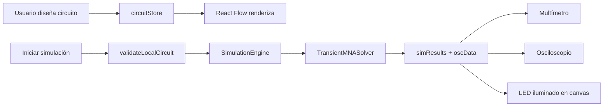

# Electro+ Lab — Documentación para el Profesor

**Simulador de circuitos eléctricos interactivo en tiempo real**

| Campo | Valor |
|-------|-------|
| Nombre del producto | **Electro+ Lab** |
| Tipo | Aplicación web educativa |
| Frontend | React 18 + TypeScript + Vite |
| Motor de simulación | MNA (Modified Nodal Analysis) en el navegador |
| Backend (opcional) | Python + FastAPI + NumPy |
| Repositorio | GitHub — rama `main` |

---

## 1. ¿Qué hace el proyecto?

Electro+ Lab permite a un estudiante:

1. **Diseñar** un circuito eléctrico arrastrando componentes sobre un canvas (resistencias, capacitores, baterías, LED, diodos, etc.).
2. **Conectar** los bornes con cables ortogonales (estilo esquemático de laboratorio).
3. **Simular** el comportamiento eléctrico en tiempo real (voltajes, corrientes, potencias).
4. **Medir** con multímetro virtual y osciloscopio con sondas configurables.
5. **Consultar** una calculadora con fórmulas de ingeniería eléctrica.

La simulación principal **corre en el navegador** (JavaScript/TypeScript). No depende de internet ni del servidor para funcionar. El backend Python es un complemento opcional para validación y exportación SPICE.

---

## 2. Arquitectura general

```
┌─────────────────────────────────────────────────────────────────┐
│                     NAVEGADOR (Cliente)                         │
│  ┌──────────────┐  ┌──────────────┐  ┌──────────────────────┐  │
│  │  Interfaz    │  │  Estado      │  │  Motor MNA           │  │
│  │  React       │──│  Zustand     │──│  src/engine/         │  │
│  │  (paneles,   │  │  circuitStore│  │  TransientMNASolver  │  │
│  │   canvas)    │  │              │  │                      │  │
│  └──────────────┘  └──────────────┘  └──────────────────────┘  │
└─────────────────────────────────────────────────────────────────┘
                              │ (opcional)
                              ▼
┌─────────────────────────────────────────────────────────────────┐
│              SERVIDOR Render (Backend FastAPI)                  │
│  POST /api/simulate  ·  POST /api/simulate/validate            │
│  POST /api/netlist   ·  GET  /api/health                         │
└─────────────────────────────────────────────────────────────────┘
```

### Separación de responsabilidades

| Capa | Ubicación | Responsabilidad |
|------|-----------|-----------------|
| **Interfaz** | `src/components/`, `src/features/` | Renderizar UI, capturar clics, mostrar mediciones |
| **Estado** | `src/store/circuitStore.ts` | Guardar circuito, cables, sondas, resultados |
| **Motor** | `src/engine/` | Grafo eléctrico, matrices MNA, integración temporal |
| **Servicios** | `src/services/localSimulation.ts` | Puente entre store y motor |
| **Backend** | `backend/` | API REST, validación server-side, netlist SPICE |

---

## 3. Cómo se crea cada parte del sistema

### 3.1 Punto de entrada de la aplicación

| Archivo | Función |
|---------|---------|
| `index.html` | HTML base; carga el bundle de Vite |
| `src/main.tsx` | Monta React en el DOM |
| `src/App.tsx` | Layout principal: toolbar, canvas, paneles laterales, osciloscopio |

`App.tsx` organiza la pantalla en tres zonas:

- **Izquierda:** paleta de componentes y botón *Iniciar simulación*
- **Centro:** editor de circuito (React Flow)
- **Derecha:** propiedades, multímetro y guía del demo
- **Inferior:** osciloscopio (Plotly)

### 3.2 Editor visual (canvas)

| Archivo | Qué crea |
|---------|----------|
| `src/features/editor/CircuitEditor.tsx` | Canvas React Flow con zoom, pan y cuadrícula |
| `src/features/editor/ComponentNode.tsx` | Nodo visual de cada componente (símbolo SVG + mediciones en vivo) |
| `src/components/symbols/index.tsx` | Símbolos eléctricos (R, C, L, LED, batería, etc.) |
| `src/utils/wireToEdge.ts` | Convierte cables del store en aristas de React Flow |
| `src/utils/componentHandles.ts` | Posición de bornes (+/−) según tipo de componente |
| `src/core/constants.ts` | Cuadrícula (`GRID_SIZE = 30`), colores, plantillas de componentes |

**Flujo de creación de un componente:**

1. El usuario hace clic en un tipo en la `Toolbar`.
2. `circuitStore.addComponent()` crea el objeto `CircuitComponent` con dos terminales y un `nodeId` eléctrico.
3. React Flow renderiza un `ComponentNode` en la posición de la cuadrícula.
4. El usuario arrastra bornes o usa la herramienta *Cable* para conectar terminales.
5. `connectTerminals()` fusiona nodos eléctricos y crea un registro `Wire`.

### 3.3 Estado global (Zustand)

`src/store/circuitStore.ts` centraliza:

- `circuit`: componentes, terminales, cables
- `probes`: sondas del osciloscopio
- `oscData`: series temporales `{ t, v }` por sonda
- `simResults`: último paso de simulación (voltajes de nodo, corrientes de rama)
- `simulationRunning`: bandera de simulación activa

Acciones principales: `addComponent`, `connectTerminals`, `updateComponentParam`, `toggleSimulation`, `addProbe`.

### 3.4 Motor de simulación (MNA)

El motor vive en `src/engine/` **sin dependencias de React**.

| Módulo | Función |
|--------|---------|
| `SimulationEngine.ts` | Orquestador: sincroniza circuito, valida, avanza pasos |
| `core/CircuitGraph.ts` | Grafo: terminales = vértices, componentes/cables = aristas |
| `core/ElementRegistry.ts` | Registro de modelos por tipo (`resistor`, `led`, …) |
| `elements/index.ts` | *Stamps* MNA de cada elemento (conductancias, fuentes) |
| `solvers/MatrixBuilder.ts` | Construye matriz de admitancias **G** y vector **b** |
| `solvers/TransientMNASolver.ts` | Resuelve MNA + Euler hacia atrás para transitorios |
| `math/GaussianElimination.ts` | Elimina Gauss para resolver **Gx = b** |
| `validation/CircuitValidator.ts` | Reglas: GND, cortocircuitos, nodos flotantes, polos sueltos |

#### Fundamento matemático (resumen)

Para cada paso de tiempo Δt:

1. Se construye el sistema nodal modificado: **G·x = b**
2. Se resuelve con eliminación gaussiana
3. Se extraen voltajes de nodo y corrientes de rama
4. Para capacitores e inductores se usa integración **Backward Euler**
5. Para diodos y LED se itera Newton (hasta 12 iteraciones) para converger el punto de operación

#### Modelos de componentes implementados

| Componente | Modelo |
|------------|--------|
| Resistencia | Conductancia G = 1/R |
| Capacitor | Companion model (Euler) |
| Inductor | Companion model (Euler) |
| Batería | Fuente de tensión + ecuación de rama |
| LED / Diodo | Modelo piecewise (R_on, R_off, V_f) |
| Interruptor | R_on o R_off según `isClosed` |
| Amperímetro | Resistencia serie 0,1 Ω (evita singularidad numérica) |
| Voltímetro | Resistencia alta (10 MΩ) |
| Transistor | Placeholder alta impedancia (1 GΩ) |

### 3.5 Bucle de simulación en tiempo real

| Archivo | Rol |
|---------|-----|
| `src/hooks/useSimulation.ts` | `requestAnimationFrame` a 60 Hz (`DT = 1/60 s`) |
| `src/services/localSimulation.ts` | `runLocalSimulationStep()`, `validateLocalCircuit()` |
| `src/utils/componentReadings.ts` | Calcula V, I, P de un componente desde resultados |
| `src/utils/probeSample.ts` | Muestra instantánea para cada sonda |

**Secuencia al pulsar Iniciar:**

```
Usuario → Toolbar (validación previa)
       → toggleSimulation() → simulationRunning = true
       → useSimulation: validateLocalCircuit()
       → resetLocalSimulation() + clearOscData()
       → cada 16 ms: runLocalSimulationStep(DT)
       → actualiza simResults, oscData, simTime
       → ComponentNode, MultimeterDisplay, GraphPanel se re-renderizan
```

### 3.6 Multímetro y osciloscopio

| Componente | Archivo | Función |
|------------|---------|---------|
| Multímetro | `src/components/multimeter/MultimeterDisplay.tsx` | Muestra V, I, P del componente seleccionado |
| Osciloscopio | `src/components/graph/GraphPanel.tsx` | Gráficas Plotly de sondas activas |
| Sondas | `PropertiesPanel.tsx` → botones `+V osc` / `+I osc` | Añaden probes al store |
| Hook gráficas | `src/hooks/useGraph.ts` | Convierte `oscData` en trazas visibles |

### 3.7 Circuito de demostración

`src/utils/loadDemo.ts` construye automáticamente un circuito en forma de **U** con todos los tipos de componente:

```
Bat(+) → SW → Amm → R → D → LED → L → GND → Bat(−)
Paralelos: VM y Cap sobre LED; Pot sobre R; Trans sobre LED
```

Parámetros: 9 V, R = 470 Ω, LED Vf = 2 V, C = 47 µF, L = 10 mH. Incluye 4 sondas de osciloscopio preconfiguradas.

### 3.8 Backend (FastAPI)

| Archivo | Función |
|---------|---------|
| `backend/main.py` | Aplicación FastAPI, CORS, versión 0.1.2 |
| `backend/api/routes.py` | Endpoints REST |
| `backend/simulation/engine.py` | Motor MNA en Python (NumPy) — espejo del front |
| `backend/validators/circuit_validator.py` | Validación estructural |
| `backend/models/circuit.py` | DTOs Pydantic del circuito |
| `backend/spice/builder.py` | Generación de netlist SPICE |

El backend se despliega en **Render**; el frontend en **Vercel**. Ver `docs/DEPLOY.md`.

---

## 4. Flujo de datos completo



---

## 5. Validaciones implementadas

Antes de simular, el validador comprueba:

- Existencia de **un solo GND**
- **Batería:** polo + conectado al circuito, polo − a tierra
- **Cortocircuitos** directos fuente–tierra
- **Nodos flotantes** sin camino a GND
- **Cables duplicados**
- Componentes sueltos (advertencia, no bloquean)

Si hay error, se muestra en la barra de estado y con un toast; la simulación no arranca.

---

## 6. Despliegue

| Servicio | Plataforma | URL típica |
|----------|------------|------------|
| Frontend | Vercel | `https://*.vercel.app` |
| Backend | Render | `https://*.onrender.com` |

- `vercel.json` fuerza build estático Vite (no detecta Python).
- `render.yaml` + `render-start.sh` arrancan uvicorn desde la raíz del repo.
- Variable opcional en Vercel: `VITE_API_URL`.

---

## 7. Cómo ejecutar localmente

```bash
# Instalar dependencias
pnpm install

# Frontend (puerto 5174)
pnpm dev

# Backend opcional (puerto 8000)
python -m uvicorn backend.main:app --host 0.0.0.0 --port 8000

# Build de producción
pnpm run build

# Test del circuito demo (motor)
pnpm dlx tsx src/engine/demo/demoCircuitTest.ts
```

### Prueba recomendada para la exposición

1. Abrir `http://localhost:5174`
2. Clic en **Demo** (paleta izquierda)
3. Clic en **Iniciar simulación**
4. Observar: LED encendido, corriente ~12 mA en amperímetro, 4 trazas en osciloscopio
5. Seleccionar el LED → multímetro muestra caída directa y estado *Encendido*

---

## 8. Equipo y contribuciones

| Integrante | Rama | Área principal |
|------------|------|----------------|
| **Miguel Angel Alvarez Ramirez** | `feature/miguel-editor` | Editor React Flow, store, cables, hooks |
| **Luisa Fernanda Ibarra Tucano** | `feature/luisa-backend` | Motor MNA, backend FastAPI, validación |
| **David Josué Solorza Viera** | `feature/josue-ui` | UI/UX, paneles, calculadora, documentación, despliegue |

---

## 9. Documentos relacionados

| Archivo | Contenido |
|---------|-----------|
| `docs/documentacion-profesor.tex` | Versión LaTeX para entregar en PDF |
| `docs/arquitectura.md` | Diagramas técnicos |
| `docs/DEPLOY.md` | Guía de despliegue Vercel + Render |
| `docs/DOCUMENTACION_COMPLETA.md` | Manual interno del equipo |

---

## 10. Conclusión

Electro+ Lab integra **diseño visual**, **simulación numérica MNA** y **instrumentación virtual** en una sola aplicación web. El motor corre en el cliente para respuesta inmediata; el backend Python aporta validación y compatibilidad SPICE. El proyecto demuestra competencias en ingeniería eléctrica (análisis nodal), desarrollo full-stack y despliegue en la nube.
