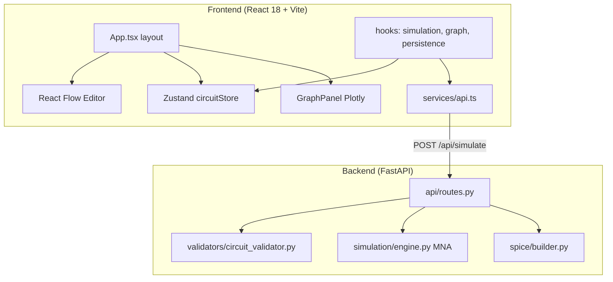

# Arquitectura — LabCircuitos

## Visión

LabCircuitos es un simulador web de circuitos eléctricos con editor visual, simulación MNA (DC/transitorio) y paneles de medición. La arquitectura **actual** es cliente-servidor; la arquitectura **objetivo** (según `acctulizacio.mkd`) añade motor TypeScript desacoplado y organización Feature-Sliced Design (FSD).

---

## Diagrama lógico (actual)



---

## Capas objetivo (FSD + Clean Architecture)

Regla de importación FSD: **una capa solo importa capas inferiores**.

```
app/          → bootstrap, providers, estilos globales
pages/        → pantalla completa del simulador
widgets/      → TopBar, ToolSidebar, PropertiesPanel, PlotBar
features/     → wire-placement, simulation-controls, plot-management…
entities/     → circuit, element, wire, node, plot
shared/       → ui, lib, api, types, constants
engine/       → motor MNA TS (sin React)
```

### Separación de responsabilidades (objetivo)

| Capa | Responsabilidad | Prohibido |
|------|-----------------|-----------|
| **UI (React)** | Render, eventos, layout | Lógica MNA, matrices |
| **Store (Zustand)** | Estado observable, acciones | HTTP directo |
| **Engine (TS)** | Grafo, stamps, solver | Importar React |
| **Backend (Python)** | Simulación server-side, SPICE, validación fuerte | Conocer UI |

---

## Flujo de simulación (actual)

1. Usuario pulsa **INICIAR** → `simulationRunning = true`
2. `useSimulation` arma `SimulateRequest` desde el store
3. `POST /api/simulate` con `analysis: transient`, `duration = DT` (~16 ms)
4. Backend: validar → resolver nodos → armar MNA → `numpy.linalg.solve`
5. Respuesta → `setSimResults` → LED, multímetro, sondas Plotly

**Problema:** un request HTTP por tick de simulación.

### Flujo objetivo

1. Cambio en circuito → invalidar cache de simulación
2. Loop `requestAnimationFrame` → `engine.step(DT)` local
3. Opcional: sync batch al backend para validación SPICE

---

## Contratos de datos

### CircuitState (frontend)

```typescript
{
  components: Record<id, CircuitComponent>
  terminals: Record<id, Terminal>
  wires: Record<id, WireDef>
  nextNodeId: number
}
```

### SimulateRequest (API)

Enviado por `src/services/api.ts` — debe mantenerse estable entre frontend y backend.

---

## Tecnologías

| Área | Actual | Objetivo (spec) |
|------|--------|-----------------|
| React | 18.3 | 19.x |
| Build | Vite 5 | Vite 5/6 |
| Editor | React Flow | Canvas 2D |
| Estado | Zustand | Zustand (FSD model segments) |
| Estilos | Tailwind tema claro | Spec: dark industrial *(decisión equipo)* |
| Gráficas | Plotly | Plotly o canvas propio (800 muestras) |
| Backend | FastAPI + NumPy | Mantener + tests |

---

## Decisiones técnicas registradas

| Decisión | Estado | Referencia |
|----------|--------|------------|
| Simulación en backend NumPy | ✅ Activo | `backend/simulation/engine.py` |
| React Flow para MVP editor | ✅ Activo | `src/features/editor/` |
| Tema claro crema/verde | ✅ Activo | `docs/TEMA_UI.md` |
| Tema dark industrial (spec) | ⏳ Pendiente | `acctulizacio.mkd` |
| FSD completo | ⏳ Planificado | `docs/estructura-proyecto.md` |
| Motor TS independiente | ⏳ Planificado | Sprint 3 |

---

## Referencias

- [Feature-Sliced Design — Overview](https://feature-sliced.design/docs/get-started/overview)
- `docs/estructura-proyecto.md` — mapa de carpetas
- `docs/INFORME-AUDITORIA.md` — deuda técnica
