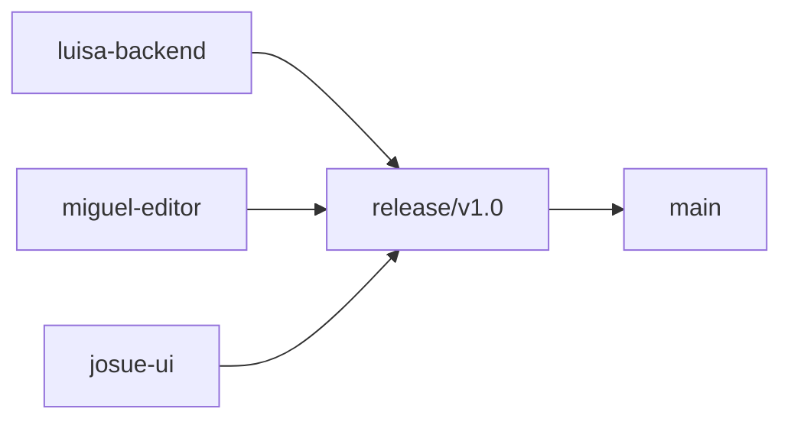

# Roadmap y backlog — LabCircuitos

Basado en `acctulizacio.mkd` y auditoría del 2026-06-02.

---

## Visión por fases

| Fase | Meta | Estado |
|------|------|--------|
| **v0.1** | MVP funcional (editor + sim backend) | ✅ Hecho |
| **v0.2** | Calidad tooling + docs + UI pulida + motor TS local | ✅ En `feature/josue-ui` |
| **v0.3** | FSD incremental + split store | ⏳ Sprint 2 |
| **v0.4** | Motor MNA TypeScript local | ✅ En `feature/josue-ui` |
| **v1.0** | Integración `release/v1.0` → `main` | ⏳ Sprint 4 |

---

## Backlog completo (priorizado)

### P0 — Bloqueantes para v1.0

| ID | Tarea | Rama sugerida | Est. | Depende de |
|----|-------|---------------|------|------------|
| TASK-001 | Integrar ramas a `release/v1.0` sin regresiones | Equipo | 8h | — |
| TASK-002 | Lazy-load Plotly (code splitting) | `feature/josue-ui` | 4h | ✅ |
| TASK-003 | Extraer formateo eléctrico compartido (`fmtV/fmtI`) | `feature/josue-ui` | 2h | ✅ |
| TASK-006 | Motor local (sin polling HTTP) | `feature/josue-ui` | 8h | ✅ |
| TASK-004 | Alinear `ComponentType` backend con frontend | `feature/luisa-backend` | 4h | — |
| TASK-005 | Unificar resolución de nodos validator+engine | `feature/luisa-backend` | 4h | — |
| TASK-007 | Dividir `circuitStore.ts` en slices | `feature/miguel-editor` | 8h | — |
| TASK-008 | Tests backend regresión (`test_backend.py` ampliado) | `feature/luisa-backend` | 6h | — |

### P1 — Arquitectura spec

| ID | Tarea | Rama | Est. | Depende de |
|----|-------|------|------|------------|
| TASK-009 | Migración FSD fase 1 (shared + widgets) | `feature/josue-ui` | 12h | — |
| TASK-010 | Motor `src/engine/` completo | `feature/josue-ui` | 16h | ✅ |
| TASK-011 | TransientMNASolver TS (9 componentes) | `feature/josue-ui` | 20h | ✅ |
| TASK-012 | ElementRegistry polimórfico | `feature/josue-ui` | 12h | ✅ |
| TASK-013 | Upgrade React 18 → 19 | `feature/josue-ui` | 4h | TASK-009 |
| TASK-014 | Atajos teclado (R,C,L,V,I,S,G,W,Delete,Ctrl+Z/Y) | `feature/miguel-editor` | 6h | — |
| TASK-015 | CORS configurable por env | `feature/luisa-backend` | 2h | — |

### P2 — UX / spec visual

| ID | Tarea | Rama | Est. |
|----|-------|------|------|
| TASK-016 | Decidir tema: claro actual vs dark spec | Equipo | 2h |
| TASK-017 | Implementar tema acordado | `feature/josue-ui` | 8h |
| TASK-018 | Snackbar errores simulación | `feature/josue-ui` | 4h |
| TASK-019 | Export CSV gráficas | `feature/josue-ui` | 4h |
| TASK-020 | Dividir CalculatorPage por tabs | `feature/josue-ui` | 6h |
| TASK-021 | Tooltips en componentes toolbar | `feature/josue-ui` | 4h |

### P3 — Futuro / v2

| ID | Tarea | Est. |
|----|-------|------|
| TASK-022 | Canvas 2D renderer (reemplazar React Flow) | 40h+ |
| TASK-023 | Vitest + tests store/engine | 12h |
| TASK-024 | GitHub Actions CI | 4h |
| TASK-025 | Docker compose frontend+backend | 6h |
| TASK-026 | Autosave cloud / auth | Fuera scope v1 |

---

## Asignación de ramas (Fase 5)

| Rama | Responsable | Objetivos | Archivos clave | Riesgo conflicto |
|------|-------------|-----------|----------------|------------------|
| `feature/luisa-backend` | Luisa | **Simulación** (MNA, validación, `src/engine/`, backend) | `backend/**`, `src/engine/**` | Paridad TS↔Python |
| `feature/miguel-editor` | Miguel | **Editor** (React Flow, store, cables, atajos) | `src/features/**`, `src/store/**` | Sin tocar motor |
| `feature/josue-ui` | Josue | **UI**, paneles, docs, coordinación | `src/components/**`, `docs/**` | Revisión PRs |
| `release/v1.0` | Equipo | Integración | Todo | — |
| `main` | Equipo | Estable | — | — |

### Ramas propuestas adicionales (Git Flow spec)

| Rama | Uso |
|------|-----|
| `develop` | Opcional — puede mapearse a `release/v1.0` en este proyecto |
| `feature/simulator` | Alias de trabajo motor+editor si se unifica Miguel |
| `fix/critical-bugs` | Hotfixes |

---

## Plan de integración (Fase 6)

### Orden de desarrollo

```
1. Luisa: API estable + tests
2. Miguel: editor + store refactor
3. Josue: UI FSD + performance Plotly
4. Integración release/v1.0
5. QA manual 10 pasos
6. main
```

### Dependencias entre ramas



### Frecuencia de sync

- **Diaria:** `git merge origin/main` en tu feature  
- **Pre-PR:** merge de `main` + build local  
- **Pre-release:** reunión de 30 min demo cruzada  

### Code review

- Mínimo **2 aprobaciones** por PR  
- Josue verifica build + checklist UI  
- Luisa verifica contratos API  
- Miguel verifica editor/store  

---

## Sprints

### Sprint 1 — Fundamentos (semana 1) 🔄

**Objetivo:** Tooling, docs, fixes críticos, app estable.

| Historia | Tareas |
|----------|--------|
| Como dev quiero lint/format | ESLint, Prettier ✅ |
| Como dev quiero docs | docs/* ✅ |
| Como usuario quiero arrancar backend fácil | fix main.py ✅ |
| Como usuario quiero app más rápida | TASK-002 Plotly lazy |

**Entregables:** docs completos, `pnpm lint/build` verdes.  
**Riesgos:** Conflictos CRLF Windows.

---

### Sprint 2 — Estructura (semana 2)

**Objetivo:** FSD fase 1 + store modular + React 19.

| Historia | Tareas |
|----------|--------|
| Como dev quiero código organizado | TASK-009 FSD widgets |
| Como dev quiero store mantenible | TASK-007 split store |
| Como dev quiero stack actualizado | TASK-013 React 19 |
| Como usuario quiero atajos | TASK-014 |

**Entregables:** carpetas `widgets/`, store dividido, React 19.  
**Riesgos:** Breaking changes React 19 en dependencias.

---

### Sprint 3 — Motor (semana 3)

**Objetivo:** Engine TS MNA mínimo + menos HTTP.

| Historia | Tareas |
|----------|--------|
| Como dev quiero simular sin React | TASK-010 scaffold engine |
| Como usuario quiero simulación fluida | TASK-011 solver + TASK-006 |
| Como dev quiero extender componentes | TASK-012 registry |

**Entregables:** `src/engine/` con R+V+GND, demo offline.  
**Riesgos:** Divergencia resultados TS vs Python — tests comparativos.

---

### Sprint 4 — Entrega (semana 4)

**Objetivo:** Integración v1.0, QA, presentación.

| Historia | Tareas |
|----------|--------|
| Como equipo queremos entregar | TASK-001 merge release |
| Como equipo queremos calidad | Checklist 10 pasos + TASK-008 |
| Como equipo queremos main estable | PR release → main |

**Entregables:** tag v1.0.0, presentación, demo circuito.  
**Riesgos:** Merge conflicts masivos si no hubo sync diario.

---

## Criterios de aceptación globales (v1.0)

- [ ] Circuito demo carga y simula  
- [ ] LED enciende/apaga con INICIAR/DETENER  
- [ ] Multímetro muestra V/I/P  
- [ ] Osciloscopio con ≥1 sonda  
- [ ] Calculadora tab Ohm funcional  
- [ ] `pnpm build` + `pnpm lint` OK  
- [ ] Backend `:8000/api/health` OK  
- [ ] Documentación completa en `docs/`  
- [ ] 3 aprobaciones para merge `main`

---

## Resumen ejecutivo para el equipo

LabCircuitos **funciona hoy** como MVP cliente-servidor. La actualización integral requiere **4 sprints** para acercarse a la spec (FSD, engine TS, calidad profesional) **sin detener la entrega**. Prioridad inmediata: **performance Plotly**, **modularizar store**, **integrar ramas en release/v1.0**. Decisión pendiente: **tema claro vs dark industrial**.

Ver también: `docs/INFORME-AUDITORIA.md`
